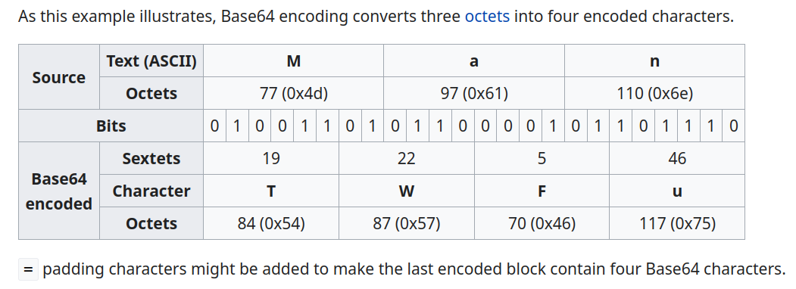
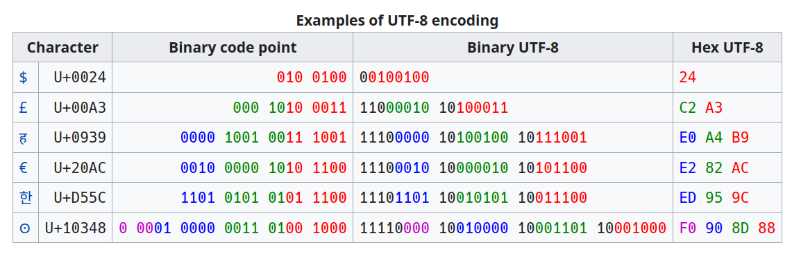

# COLL 123: Intro to CTFs

---

## `whoami`

---

## hacking

## CTFs

---

- learn things on the fly
- ~~googling~~ looking things up
- programming xp
- patience
- [module-specific]

---

## coll 123

- prereqs
- expectations
- syllabus
- assignments
- grading
- lecture logistics

---

## syllabus

- **web**
- **rev**
- **pwn**
- **crypto**
- forensics
- misc

---

## assignments

- around 10 chals per week
- flags + "writeup"
- no collaboration
- looking things up is okay
- don't attack infrastructure

---

## setup

supported OSes: linux, windows >=10, macos
windows users: install wsl2

- python >=3.5
- pip
- netcat (`nc`)
- text editor
- …

---

```sh
pip install pwntools
```

## `from pwn import *`

---

## bytes

---

## encodings

- hex
- base64
- utf8
- {,un}packing

---

### hex

```py
h = b'foo bar'.hex()
print(h)
print(bytes.fromhex(h))
print(bytes.fromhex(h).decode('utf-8'))
```

---

### [base64](https://datatracker.ietf.org/doc/html/rfc4648#section-4)

<!-- https://en.wikipedia.org/wiki/Base64#Examples -->


---

```sh
echo -n 'foo bar' | base64
echo 'cml4bmVy' | base64 -d
```

```py
import base64
print(base64.b64encode(b'foo bar'))
print(base64.b64decode(b'cml4bmVy'))
```

---

### utf-8

<!-- https://en.wikipedia.org/wiki/UTF-8#Examples -->


---

### {,un}packing

```py
n = unpack(b'foo', 'all')
pack(n, 'all')

pack(0xdeadbeef, 'all') # little-endian
```

---

## `nc [host] [port]`

---

### [`remote`](https://docs.pwntools.com/en/stable/tubes/sockets.html#module-pwnlib.tubes.remote)

```py
r = remote('123.sec.rice.edu', 60_000)

print(r.readline())
r.sendline(b'something')
print(r.readline())
```
