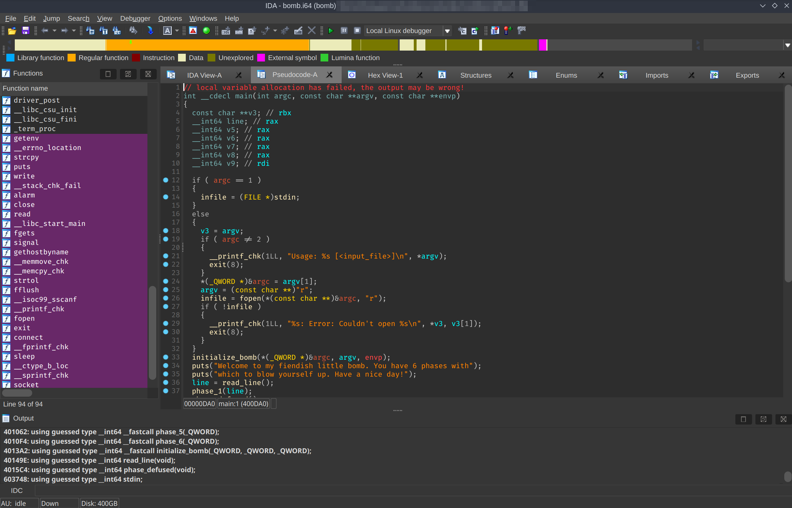

# rev

- source code obfuscation
- disassemblers and decompilers
- debugging
- binary analysis
  - dynamic (gdb)
  - static (ida)
- network request analysis?

---

## source code obfuscation

tools:

- auto-formatters
- dynamic analysis

---

tangent: code-golfing

- intentional code obfuscation and minification
- ioccc
- [code.golf](https://code.golf/)
- [code golf se](https://codegolf.stackexchange.com/)

---

- what are binaries?
  - machine code bytes
  - vs assembly
- …is a disassembler?
- …is a decompiler?

---

things you can reverse engineer:

- java `.class` files
- android apk files
- python `.pyc` files
- macos `.app` files
- windows `.exe` files
- ==linux (x86-64) elf executables==
- …

---

- `strings`

  ```
  strings ./program
  ```

- `hexdump` (or `hexyl`)

  ```
  hexdump ./program
  cat shellcode | hexdump
  ```

---

## debugging

gnu debugger!

- debugging symbols
- or not…
- extensions
  - pwndbg
  - gef
- gdb scripts
- pwntools integration

---

```
gdb ./program
gdb --args ./program foo # ...
```

```
r # run
q # quit
```

```gdb
b func # break
b *func+13
c # continue
s # step
n # next
```

---

```
info functions
info frame
p $rax # print $rax
x/10x 0xfffe8ccc
x/c 0xfffe8ccc
```

---

## general re tips

- combine static + dynamic analysis
- breakpoints after state changes
- breakpoints at comparisons
- when looking at disassembly, focus on relevant sections and instructions

---

## x86-64 asm

x86-64 (aka amd64 aka x64): intel's architecture

x86-64 assembly:

- **intel syntax**
- at&t syntax

---

### instructions

- registers
- data transfer
  - immediates
  - registers
  - memory
  - stack
- arithmetic
- logic
- control transfer
- …

---

### registers

64-bit. some have special uses.

- `rax`, `rbx`, `rcx`, `rdx`
- `rdi`
- `rsi`
- `rbp` — base pointer
- `rsp` — stack pointer

---

### data transfer

```asm
mov rax, 5
mov [rbx], 5
mov [rbx], rcx
```

```
push rax
pop rbx
```

---

### arithmetic

```
add rbx, 5 # add
add rbx, rcx
sub rbx, 5 # subtract
inc rbx # increment
dec rbx # decrement

add [rdx], 5
```

---

### control transfer

```
cmp eax, 0
jz fail
```

```
mov rax, ...
syscall
```

---

## ida



---

- view decompilation (hit `Tab`)
- rename variables and functions
- change "inferred" types
- debugger (supposedly unreliable)
