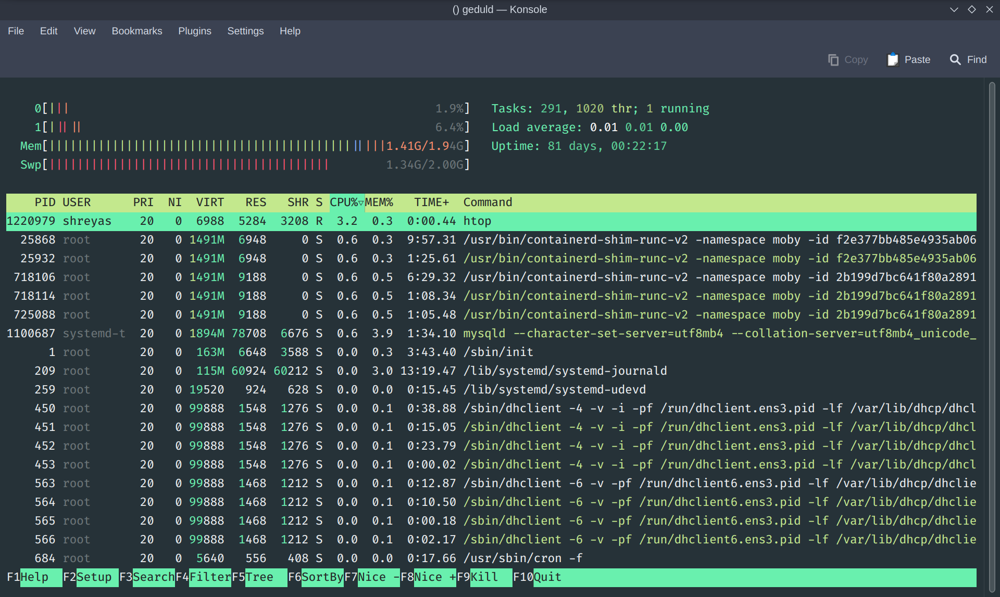

# outro

---

## logistics

- accepting submissions until 11:59 pm on may 2
- all writeup submissions are now open
- focus on your finals 🤓

---

## logistics

- site will stay online until second week of may
- canvas will remain public and accessible
- (some) challenge sources on [the repo](https://github.com/shreyasminocha/coll123)
- solutions won't be released :|
  - contact me for solutions
  - collaboration on all chals now permitted

    same policy as earlier

---

- 2780 total possible points
- 64 flags
    - intro: 7
    - web: 19 (+2 ec)
    - rev: 9 (+1 ec)
    - pwn: 10
    - crypto: 10
    - forensics: 6

---

---

---

---

---

---

---

---

---

---

---

---

honourable mentions: idc3, phillies5678, aw47, magic_army13, cud, ahsoka

---

- exit survey coming soon?

  free flag?!

- please fill up the course and instructor evals lol

  [insert _`eval` considered dangerous_ joke]

---

## what next?

- [pwn.college](https://pwn.college)
- [ctftime](https://ctftime.org/)
- defcon
- [(…)](https://canvas.rice.edu/courses/55235/pages/how-to-git-gud?module_item_id=593541)

---

---

---

---

shoutout to dr dan wallach for sponsoring this class!

---

## like, comment, share, subscribe

- [sec.rice.edu](https://sec.rice.edu)
- [ricesec discord](https://discord.gg/RA4vczwP8x)
- [ricesec owlnest](https://owlnest.rice.edu/organization/ricesec)
- [shreyasminocha/coll123](https://github.com/shreyasminocha/coll123)
